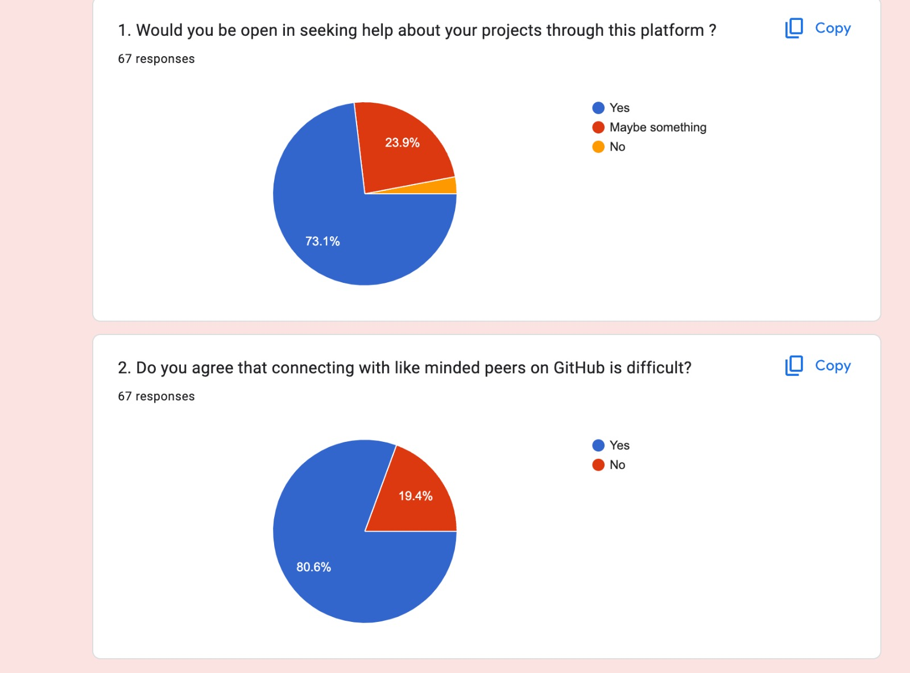
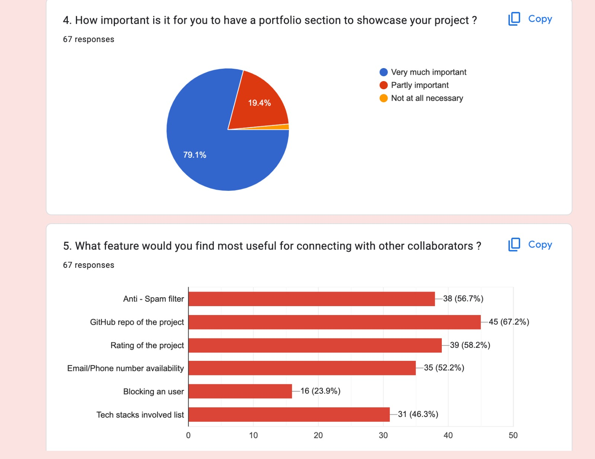
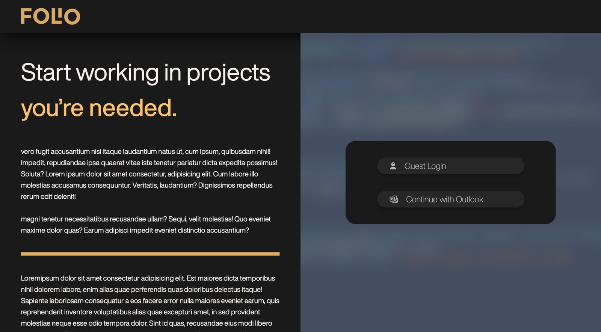
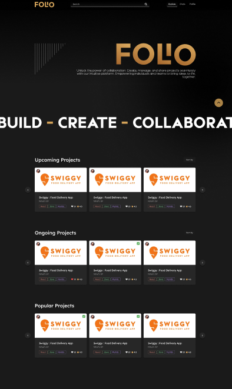
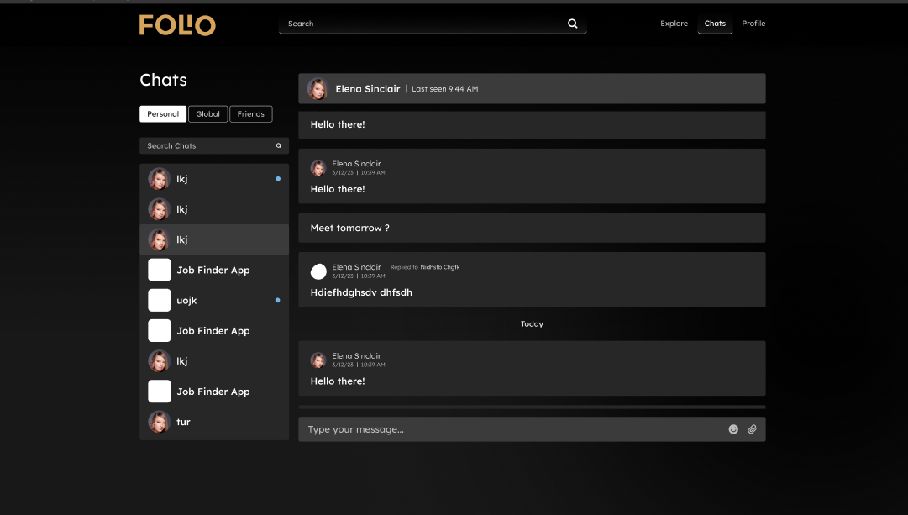
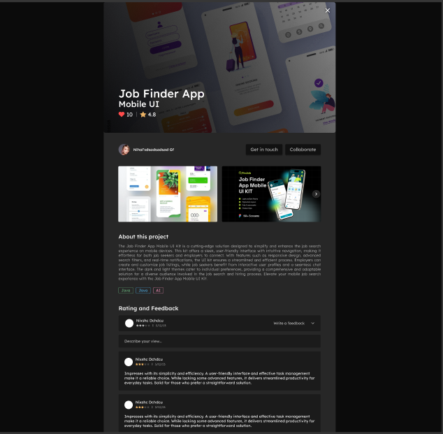
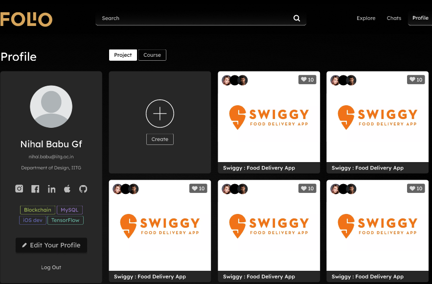
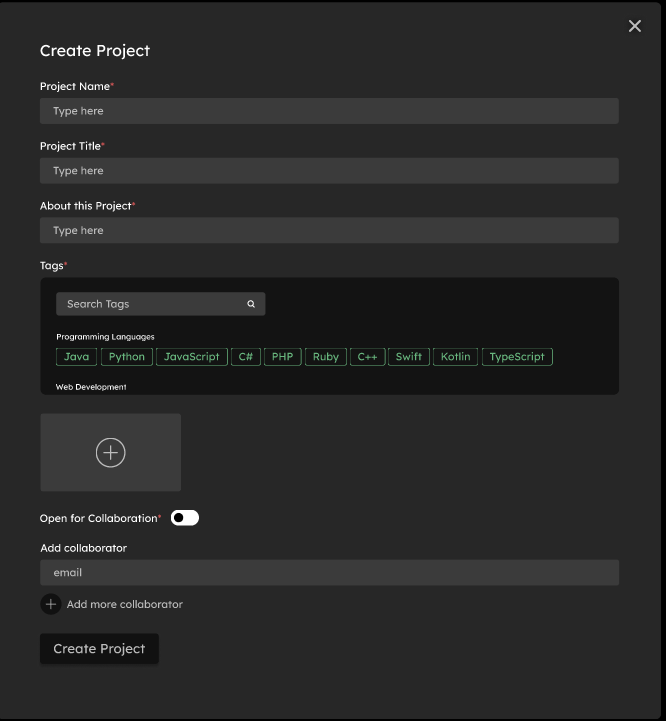
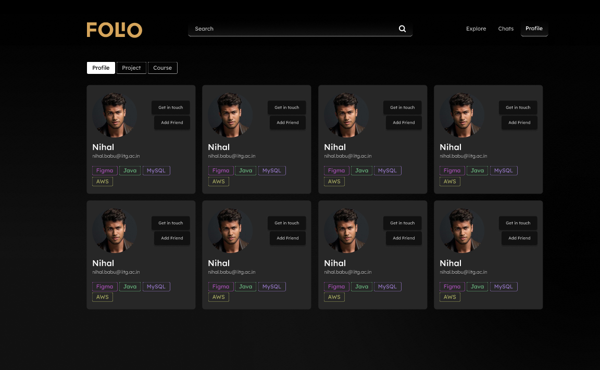

# Campus Collaboration


## Description

This website provides college students a platform to
collaborate and showcase their projects. It also allows them to connect with like-minded peers.
It should include a variety of features to enhance user eWperience and foster
collaboration. 

Enable students to post details about their projects, including descriptions,
objectives, technologies used, and outcomes. Include multimedia support for
images, videos, and documents to provide a comprehensive view of the
projects.

## User Research Insights

 







## Overview

Our collaborative platform for college students aims to provide a space for collaboration, project showcase, and connecting with like-minded peers. The development of this platform is informed by user research insights obtained from a survey with 67 respondents.

## Key Findings

1. **Openness to Collaboration:**
   - 72% of college students expressed openness to seeking help and collaboration on our platform, indicating a positive attitude towards community-driven engagement.

2. **Challenges in College Collaboration:**
   - 80% of participants highlighted the difficulty in connecting with like-minded peers on existing platforms, underscoring the need for effective mechanisms on our platform.

3. **Comfort in Sharing Projects:**
   - Comfort levels varied, with 48% feeling very comfortable and 40% somewhat comfortable in sharing their projects online, emphasizing the importance of creating an inclusive environment.

4. **Importance of Project Details:**
   - An overwhelming 82% stressed the significance of having a dedicated section for posting project details, aligning with our goal to enable comprehensive project showcases.

5. **Multimedia Support:**
   - 73% of respondents emphasized the importance of multimedia support, including images, videos, and documents, to provide a richer and more immersive view of showcased projects.

6. **Enhanced User Experience:**
   - Users highlighted the importance of features such as a user-friendly project posting interface, effective project search, and collaborative tools for an enhanced platform experience.

## Impact on Platform Ideation

Armed with these insights, our platform's ideation phase has been refined to address the specific needs and expectations of college students. Emphasis on detailed project descriptions and multimedia support will be integral, fostering a comprehensive view of showcased projects. Understanding challenges in connecting with peers informs the development of features that promote meaningful collaborations.

As we move forward, these insights will guide the development of a collaborative platform that exceeds the expectations of college students, providing them with a vibrant and supportive space to showcase projects and connect with like-minded individuals.


## Design of Pages

The design of pages is at [Figma File Link](https://www.figma.com/file/uglTzpF9RVahosX0g2aU5u/Kriti24-App-Dev?type=design&node-id=1046-2151&mode=design&t=XY9j1ci3AIUhR2Wl-0)

Login Page



Explore Page



Personal Chat 



Project Page



Profile Page



Create Page



Search Profile




## Tech-Stack Used

* [MongoDB](https://www.mongodb.com/) - The database
* [Express.js](https://expressjs.com/) - The web framework
* [React](https://reactjs.org/) - The frontend library
* [Node.js](https://nodejs.org/) - The server environment
* [MSAL] - The Outlook Login


## Dependencies

### Front End Dependencies


- **@emotion/react**: ^11.11.3
- **@emotion/styled**: ^11.11.0
- **@mui/material**: ^5.15.9
- **@testing-library/jest-dom**: ^5.17.0
- **@testing-library/react**: ^13.4.0
- **@testing-library/user-event**: ^13.5.0
- **axios**: ^1.6.7
- **bootstrap**: ^5.3.2
- **cloudinary**: ^2.0.1
- **react**: ^18.2.0
- **react-bootstrap**: ^2.10.0
- **react-dom**: ^18.2.0
- **react-icons**: ^5.0.1
- **react-router-dom**: ^6.22.0
- **react-scripts**: ^5.0.1
- **socket.io**: ^4.7.4
- **socket.io-client**: ^4.7.4
- **web-vitals**: ^2.1.4


### Server-side Dependencies

- **body-parser**: ^1.20.2
- **cloudinary**: ^2.0.0
- **cors**: ^2.8.5
- **dotenv**: ^16.4.1
- **ejs**: ^3.1.9
- **express**: ^4.18.2
- **fs**: ^0.0.1-security
- **lodash**: ^4.17.21
- **method-override**: ^3.0.0
- **mongodb**: ^6.3.0
- **mongoose**: ^8.1.1
- **multer**: ^1.4.5-lts.1
- **multer-storage-cloudinary**: ^4.0.0
- **nodemon**: ^3.0.3
- **socket.io**: ^4.7.4


## Installation
In the terminal run the following command to run the code. 

The following code installs all the libraries required for proper functioning of the project.
```bash
npm i
```
The following code snippet starts the rendering of the website.
```bash
npm start
```


## Usage

After running the following command in the terminal 
```bash 
npm start
```
The server should now be running on [http://localhost:3000](http://localhost:3000).


## Contact

* [Tanmay Mittal](https://github.com/Tanmay7404) 
* [Rishi Tirpude](https://github.com/RishiTirpude19)
* [Sushant Kumar](https://github.com/LegendsDen/)
* [Simon Lalremsiama Shangpliang](https://github.com/SimonShangpliang)
* [Syed Wahid Alam](https://github.com/Wahid-1416)
* [Priyanshu Pratyay](https://github.com/PPratyay/)
* [Soumya Savarn](https://github.com/soumyasavarn)
* [Om Gajjar](https://github.com/omgajjar18)

